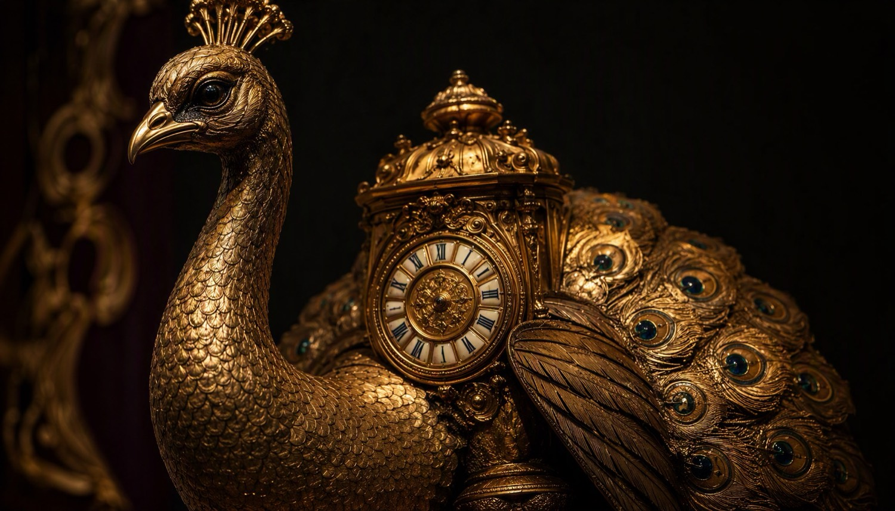

# Hermitage Review — Issue No. I

> An editorial atlas of the State Hermitage Museum: objects, stories, timelines and the global routes that carried them to the Neva.

A magazine-style, horizontally-scrolling single-page site. Seven full-screen spreads turn like the folios of a printed review — scroll, drag, or use the keyboard. Fully bilingual (RU / EN), with no frameworks and no build step.

**Live demo:** _add your Vercel URL here after publishing, e.g. `https://hermitage-review.vercel.app`_



---

## Contents

- [Features](#features)
- [Tech stack](#tech-stack)
- [Project structure](#project-structure)
- [Running locally](#running-locally)
- [Deployment to Vercel](#deployment-to-vercel)
- [Architecture notes](#architecture-notes)
- [Credits](#credits)

---

## Features

- **7 editorial spreads** — Cover, The Invitation, Featured Collections, Curatorial Note, Timeline (1754 → Today), Routes & Provenance, Closing & Colophon
- **Horizontal page-turning** — mouse wheel, pointer drag, arrow keys / Space / PageUp / PageDown / Home / End, side rail with Roman-numeral ticks, and prev/next arrows
- **Scroll-linked motion** — 3D page-tilt (`perspective` + `rotateY`), layered parallax via `data-depth` attributes, staggered reveal animations
- **Bilingual RU / EN** — complete inline translation table, auto-detects browser language, persists choice in `localStorage`, toggles live without reload
- **Accessibility** — ARIA labels on all interactive regions, keyboard-navigable throughout, `aria-current` on the rail, full `prefers-reduced-motion` support (motion disabled, navigation unaffected)
- **Editorial design system** — CSS custom-property palette (ink, bronze, oxblood, parchment), Cormorant Garamond / EB Garamond / Archivo typography, animated film-grain overlay
- **Zero dependencies** — vanilla HTML/CSS/JS; only external resource is Google Fonts

## Tech stack

| Layer | Technology |
|---|---|
| Markup | Hand-authored semantic HTML5 |
| Styling | Modern CSS — custom properties, `clamp()` fluid type, grid/flex, 3D transforms |
| Scripting | Vanilla ES6 (single IIFE, no framework, no bundler) |
| i18n | CSS-selector-keyed translation dictionary in `main.js` |
| Images | Pre-optimized JPGs in `web/assets/` (~6 MB total) |
| Fonts | Google Fonts (Cormorant Garamond, EB Garamond, Archivo) |

## Project structure

```
Hermitage_Museum/
├── web/                    # Site root — this is what gets deployed
│   ├── index.html          # All 7 spreads, semantic markup
│   ├── styles.css          # Editorial design system + layouts (531 lines)
│   ├── main.js             # Navigation, motion, i18n engine (~440 lines)
│   ├── vercel.json         # Vercel config (clean URLs, asset cache headers)
│   └── assets/             # 12 optimized JPG plates
├── vibe_images/            # Original AI-rendered PNG sources (not deployed)
└── README.md
```

## Running locally

No install needed — just serve the `web/` folder statically:

```bash
# Option 1: Python
cd web && python3 -m http.server 8000

# Option 2: Node
npx serve web

# Option 3: VS Code "Live Server" extension → open web/index.html
```

Then open <http://localhost:8000>.

> Opening `index.html` directly via `file://` also works, but a local server is recommended so the language-persistence (`localStorage`) behaves exactly as in production.

## Deployment to Vercel

The site lives in the `web/` subfolder, so the only thing Vercel needs to know is the **Root Directory**.

### Option A — Dashboard (recommended, 2 minutes)

1. Push this repository to GitHub:
   ```bash
   git add -A && git commit -m "Hermitage Review — Issue No. I" && git push
   ```
2. Go to [vercel.com/new](https://vercel.com/new) and import the repo.
3. In the import settings set **Framework Preset** → `Other`.
4. Set **Root Directory** → `web/` (click *Edit* next to it).
5. Leave **Build Command** and **Output Command** empty — nothing to build.
6. Click **Deploy**. Done. ✅

### Option B — Vercel CLI

```bash
npm i -g vercel
cd web
vercel        # first deploy: preview
vercel --prod # production
```

Running the CLI from inside `web/` makes Vercel use it as the project root automatically.

What `web/vercel.json` does:

- `cleanUrls` — `/index.html` is served as `/`
- Sensible `Cache-Control` headers — 1 h browser / 1 d CDN cache for CSS & JS, 1 d browser / 7 d CDN with revalidation for the JPG plates, so image re-exports still reach visitors promptly after a redeploy

## Architecture notes

- **Page-turn model** — `#magazine` is a horizontal snap scroller of full-viewport `.spread` sections; state is derived from `scrollLeft / viewportWidth`, so wheel, drag, keyboard and rail all feed one source of truth (`main.js → goTo/setActive/onScroll`).
- **i18n model** — translations are keyed by CSS selector in the `I18N` dictionary; `applyLang()` swaps `innerHTML` in place. Adding a language = one more key per entry, no markup changes.
- **Motion budget** — all per-frame work happens inside a single `requestAnimationFrame` gate; parallax uses the compositor-friendly `translate` property.
- **Images** — `vibe_images/` contains the AI-rendered PNG originals; `web/assets/` holds the deployed JPG derivatives. Re-generate sources freely; just re-export to `web/assets/` with the same filenames.

## Credits

- Content: original editorial text written for this issue; museum facts (1764 founding, Peacock Clock, Jordan Staircase, etc.) drawn from the Hermitage's public record.
- Imagery: AI-rendered plates in the museum's palette of ink, bronze, oxblood & parchment — not photographs of real objects.
- Not affiliated with the State Hermitage Museum. Official site: [hermitagemuseum.org](https://www.hermitagemuseum.org).
